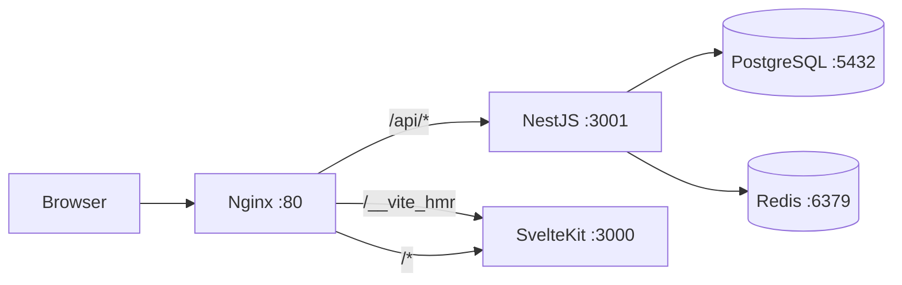

# CLAUDE.md — Project Intelligence

ไฟล์นี้เป็น **แหล่งข้อมูลหลัก** สำหรับ Claude (และนักพัฒนาทุกคน) ที่ทำงานกับ codebase นี้  
**อ่านไฟล์นี้ก่อนแก้ไขไฟล์ใด ๆ**

---

## ภาพรวมโปรเจกต์

| รายการ | รายละเอียด |
|---|---|
| **ชื่อ** | CV/Portfolio ของ นภัสรวรรณ ชัยบาล (Napatwan Chaiban) |
| **Stack** | SvelteKit · NestJS · PostgreSQL · Redis · Nginx · Docker |
| **รูปแบบ** | Monorepo (frontend + backend ใน repo เดียว, ควบคุมด้วย Docker Compose) |
| **ภาษาที่ใช้** | TypeScript ทั้ง frontend และ backend |

---

## โครงสร้าง Repository

```
Project_Intern/
├── frontend/              # SvelteKit (Vite dev server, port 3000)
│   ├── src/
│   │   ├── routes/        # หน้าเว็บและ layout (+page.svelte, +layout.svelte)
│   │   ├── lib/           # โมดูลที่ใช้ร่วมกัน (api.ts, components, utils)
│   │   └── app.html       # HTML template หลัก
│   ├── static/            # ไฟล์ static (รูปภาพ, favicon)
│   ├── svelte.config.js   # ตั้งค่า SvelteKit
│   ├── vite.config.ts     # ตั้งค่า Vite
│   ├── Dockerfile         # Production (multi-stage build)
│   └── Dockerfile.dev     # Development (hot-reload)
│
├── backend/               # NestJS REST API (port 3001)
│   ├── src/
│   │   ├── modules/
│   │   │   ├── auth/      # JWT authentication (login/register)
│   │   │   ├── users/     # จัดการข้อมูลผู้ใช้
│   │   │   ├── cv/        # จัดการข้อมูล CV (CRUD + stream)
│   │   │   └── health/    # Health check endpoint
│   │   ├── common/        # Guards, decorators, filters ที่ใช้ร่วมกัน
│   │   ├── app.module.ts  # Root module
│   │   └── main.ts        # Entry point
│   ├── Dockerfile
│   └── Dockerfile.dev
│
├── nginx/
│   └── nginx.conf         # Reverse proxy + Vite HMR WebSocket
│
├── docs/                  # เอกสารเพิ่มเติม (architecture, ADRs)
├── .github/workflows/     # CI/CD pipelines
├── docker-compose.yml     # Production
├── docker-compose.dev.yml # Development (hot-reload)
├── .env.example           # Template สำหรับ environment variables
├── CLAUDE.md              ← คุณอยู่ที่นี่
└── README.md
```

---

## สถาปัตยกรรมระบบ

```
Browser → Nginx :80/:443
              ├── /api/*       → backend:3001  (NestJS)
              ├── /__vite_hmr  → frontend:3000 (Vite HMR WebSocket — dev เท่านั้น)
              └── /*           → frontend:3000 (SvelteKit)

backend → PostgreSQL :5432
backend → Redis       :6379
```



ทุก service สื่อสารผ่าน Docker network `app-network`  
**Nginx เป็นจุดเข้าถึงเดียว** ที่เปิดสู่ภายนอก

---

## ตัวแปรสภาพแวดล้อม (Environment Variables)

คัดลอก `.env.example` → `.env` ก่อนรันทุกครั้ง

| ตัวแปร | ใช้โดย | คำอธิบาย |
|---|---|---|
| `NODE_ENV` | ทั้งสอง | `development` หรือ `production` |
| `DB_TYPE` | backend | ชนิดฐานข้อมูล (`postgres` หรือ `sqlite`) |
| `DB_HOST` | backend | Host ของฐานข้อมูล (ใน Docker ใช้ `postgres`) |
| `DB_PORT` | backend | Port ฐานข้อมูล (PostgreSQL = `5432`) |
| `DB_DATABASE` | backend | ชื่อฐานข้อมูล |
| `DB_USERNAME` | backend | Username สำหรับเชื่อมต่อ DB |
| `DB_PASSWORD` | backend | Password สำหรับเชื่อมต่อ DB |
| `REDIS_URL` | backend | Redis connection string |
| `JWT_SECRET` | backend | Secret สำหรับเซ็น JWT (อย่างน้อย 32 ตัวอักษร) |
| `JWT_EXPIRES_IN` | backend | อายุของ JWT token (เช่น `7d`) |
| `VITE_API_URL` | frontend | URL ของ API ที่ browser เห็น |
| `POSTGRES_USER` | postgres | User สำหรับ container PostgreSQL |
| `POSTGRES_PASSWORD` | postgres | Password สำหรับ container PostgreSQL |
| `POSTGRES_DB` | postgres | ชื่อ DB ที่สร้างอัตโนมัติ |
| `ALLOWED_ORIGIN` | backend | Origin ที่อนุญาตสำหรับ CORS |

> **หมายเหตุ:** ตัวแปร `VITE_*` จะถูกส่งไปยัง browser โดยอัตโนมัติ (เหมือน `NEXT_PUBLIC_*` ใน Next.js)  
> ห้ามใส่ค่า secret ใน `VITE_*` เด็ดขาด

---

## คำสั่งที่ใช้บ่อย

### Development (hot-reload)
```bash
# สร้างและรันทุก service พร้อม hot-reload
docker compose -f docker-compose.dev.yml up --build

# รัน background
docker compose -f docker-compose.dev.yml up -d --build

# ดู logs
docker compose -f docker-compose.dev.yml logs -f frontend
docker compose -f docker-compose.dev.yml logs -f backend

# หยุดและลบ containers
docker compose -f docker-compose.dev.yml down

# ลบ volumes ด้วย (ล้างข้อมูล DB)
docker compose -f docker-compose.dev.yml down -v
```

### Production
```bash
# สร้างและรัน production
docker compose up -d --build

# ตรวจสอบสถานะ
docker compose ps

# หยุด production
docker compose down
```

### รัน backend อย่างเดียว (local)
```bash
cd backend && npm install && npm run start:dev
```

### รัน frontend อย่างเดียว (local)
```bash
cd frontend && npm install && npm run dev
```

### Database migrations
```bash
docker compose exec backend npm run migration:run
docker compose exec backend npm run migration:generate -- -n MigrationName
docker compose exec backend npm run migration:revert
```

---

## Coding Conventions

### Frontend (SvelteKit)
- ใช้ **file-based routing** ใน `src/routes/`
- แต่ละหน้าเว็บคือ `+page.svelte`, layout คือ `+layout.svelte`
- ข้อมูลที่ต้อง load ฝั่ง server ใช้ `+page.server.ts` หรือ `+page.ts`
- API calls รวมอยู่ที่ `src/lib/api.ts` — ห้ามใช้ `fetch()` ตรง ๆ
- ตัวแปร environment ฝั่ง client ต้องขึ้นต้นด้วย `VITE_`
- ใช้ **Tailwind CSS** สำหรับ styling — ห้ามใช้ inline styles
- ข้อความ UI เป็นภาษาไทย, ชื่อตัวแปรเป็นภาษาอังกฤษ
- ใช้ TypeScript strict mode

### Backend (NestJS)
- โครงสร้างแบบ feature-based: `src/modules/<feature>/`
- แต่ละ module มี: `controller`, `service`, `dto`, `entity`, `module`
- DTOs ใช้ `class-validator` decorators
- ทุก endpoint ต้องผ่าน JWT guard ยกเว้นติด decorator `@Public()`
- ใช้ `ConfigService` เสมอ — **ห้ามใช้ `process.env` โดยตรง**
- Errors ใช้ NestJS `HttpException` subclasses
- ฐานข้อมูลเชื่อมต่อผ่าน TypeORM

### ทั่วไป
- Commits ตาม Conventional Commits: `feat:`, `fix:`, `docs:`, `chore:`, `refactor:`, `test:`
- Secrets ทั้งหมดผ่าน environment variables — **ห้าม hardcode**
- TypeScript strict mode ทั้ง frontend และ backend
- ใช้ ESLint + Prettier

---

## ไฟล์สำคัญที่ควรรู้

| ไฟล์ | หน้าที่ |
|---|---|
| `backend/src/app.module.ts` | Root module ของ NestJS — ลงทะเบียนทุก module |
| `backend/src/main.ts` | Entry point ของ backend (ตั้งค่า port, CORS) |
| `backend/src/modules/cv/` | Module จัดการข้อมูล CV |
| `frontend/src/routes/+layout.svelte` | Root layout ของ SvelteKit |
| `frontend/src/routes/+page.svelte` | หน้าแรกของเว็บไซต์ |
| `frontend/src/lib/api.ts` | Centralized API client |
| `frontend/svelte.config.js` | ตั้งค่า SvelteKit (adapter, paths) |
| `frontend/vite.config.ts` | ตั้งค่า Vite (plugins, proxy) |
| `nginx/nginx.conf` | กฎ routing ของ Nginx |
| `docker-compose.yml` | Orchestration สำหรับ production |
| `docker-compose.dev.yml` | Orchestration สำหรับ development |
| `.env.example` | Template ตัวแปรสภาพแวดล้อม |

---

## ข้อผิดพลาดที่พบบ่อย

1. **CORS** — backend อนุญาต `ALLOWED_ORIGIN` ที่กำหนดใน env ถ้า API ถูกบล็อก ให้ตรวจสอบค่านี้ก่อน
2. **Vite HMR ไม่ทำงาน** — ตรวจสอบว่า nginx.conf มี location block สำหรับ `/__vite_hmr` และ WebSocket upgrade headers ถูกต้อง
3. **VITE_API_URL ไม่ถูกส่งไปยัง browser** — ตัวแปร `VITE_*` ถูก embed ตอน build time ดังนั้นต้อง rebuild frontend หลังเปลี่ยนค่า
4. **Database connection ล้มเหลว** — ตรวจสอบว่า `DB_HOST`, `DB_PORT`, `DB_USERNAME`, `DB_PASSWORD` ตรงกับค่าใน postgres service
5. **Migrations** — รัน `migration:run` เสมอหลัง pull ที่มีการแก้ไข entities
6. **Redis ล่ม** — ถ้า Redis ไม่ทำงาน auth จะล้มเหลว ตรวจสอบ `redis` container ก่อน
7. **Nginx upstream** — ชื่อ service ใน `docker-compose.yml` ต้องตรงกับชื่อ upstream ใน `nginx.conf` เสมอ
8. **Port ชนกัน** — frontend ใช้ port 3000, backend ใช้ 3001 ถ้ารัน local ต้องแน่ใจว่า port ไม่ซ้ำ
9. **`/app/.next` ไม่มีแล้ว** — โปรเจกต์ migrate จาก Next.js เป็น SvelteKit ลบ reference ถึง `.next` ทั้งหมด

---

## วิธีเพิ่ม Feature ใหม่

### Backend
1. สร้าง `backend/src/modules/<name>/` พร้อม module / controller / service / dto / entity
2. ลงทะเบียน module ใน `AppModule` (`app.module.ts`)
3. สร้าง migration ถ้ามี entity ใหม่: `npm run migration:generate -- -n CreateXxxTable`

### Frontend
1. สร้าง route ใหม่ใน `frontend/src/routes/<name>/+page.svelte`
2. ถ้าต้องโหลดข้อมูลจาก server สร้าง `+page.server.ts` หรือ `+page.ts`
3. เพิ่ม API function ใน `src/lib/api.ts`
4. สร้าง component ที่ reusable ใน `src/lib/components/`

### สุดท้าย
- อัปเดตไฟล์ `CLAUDE.md` นี้ถ้ามีการเปลี่ยนแปลง architecture
- อัปเดต `README.md` ถ้ามี endpoint ใหม่
- เขียน test สำหรับทั้ง backend (Jest) และ frontend

---

## Tech Stack Reference

| เทคโนโลยี | เวอร์ชัน | หน้าที่ |
|---|---|---|
| SvelteKit | latest | Frontend framework (SSR + SPA) |
| Vite | latest | Build tool + dev server |
| NestJS | 10.x | Backend framework |
| TypeORM | 0.3.x | ORM สำหรับฐานข้อมูล |
| PostgreSQL | 16 | ฐานข้อมูลหลัก |
| Redis | 7 | Cache + session store |
| Nginx | 1.25 | Reverse proxy + load balancer |
| Docker | latest | Containerization |
| Node.js | 20 | Runtime |
| TypeScript | 5.x | ภาษาหลัก (ทั้ง frontend + backend) |
